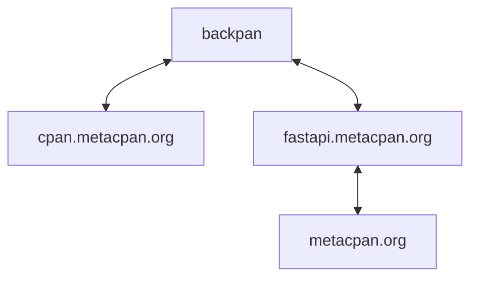

# Current infrastructure for metacpan-api / cpan.metacpan.org

## Backpan - files on disk

All servers have a full copy of the MetaCPAN's BackPAN (a full copy of
all files, even those marked as deleted in `CPAN`). This means users
can always get hold of a file.

There is currently 102G - and it is not growing fast.

The BackPAN is added to on each server by getting new updates from `cpan-rsync.perl.org`.
The we have [puppet setup rrrclient](https://github.com/metacpan/metacpan-puppet/tree/master/modules/rrrclient), it is initiated from [metacpan::rrrclient](https://github.com/metacpan/metacpan-puppet/blob/master/modules/metacpan/manifests/rrrclient.pp).

### :question: What processes happen?

- Run [File::Rsync::Mirror::Recent](https://metacpan.org/pod/File::Rsync::Mirror::Recent) as service, monitoring `cpan-rsync.perl.org::CPAN/RECENT.recent` 
- nightly restart of the service (as it sometimes glitches)
- nightly _standard_ rsync or `cpan-rsync.perl.org` to ensure no files are missed
- About once a year there is a reason to remove a file manually, this currently has to happen on all servers

#### Dependencies



## cpan.metacpan.org ( aka backpan.metacpan.org )

This site serves the static files from our `Backpan`. Fastly CDN is currently pointing to 2 ByteMark and 2 Liquid Web servers

### :exclamation: Fastly stats (for 30 days) 
- Fastly delivered 4.7 TB
- 36% was cached (seems low, but we don't ask fastly to cache everything...)
- 44.5 million requests
- 8% (3.7m) 4xx errors (mostly 404)

### :question: What processes happen

- nginx (on all `Backpan` servers) serves the `Backpan` files as per the [setup](https://github.com/metacpan/metacpan-puppet/blob/master/hieradata/common.yaml#L143-L153), worth noting the special [headers](https://github.com/metacpan/metacpan-puppet/blob/master/modules/metacpan/templates/web/metacpan-cpan-static/fastly.erb) we set for fastly
- nginx is set to `autoindex` directories [e.g](https://cpan.metacpan.org/authors/id/L/LL/LLAP/)


## fastapi.metacpan.org (aka api-v1)

Current API...

### :exclamation: Fastly stats (for 30 days) 
- Fastly delivered 3.43 TB
- 50% served from cache
- 312 million requests, 
- 224 million are fastly `passes` 

### :question: What processes happen

- Uses ElasticSearch for searching 
- It can [unarchive](https://github.com/metacpan/metacpan-api/blob/master/lib/MetaCPAN/Model/Archive.pm) files from the `backpan`, either on a `ram disk` (for speed) or `tmp` dir
- The `tmp` dir is around 350 GB (we provision 430 GB)
- The `tmp` dir is purged nightly for anything over 30 days old
- There are many [cron jobs](https://github.com/metacpan/metacpan-puppet/blob/master/hieradata/nodes/bm-mc-02.yaml#L29) using the [scripts](https://github.com/metacpan/metacpan-api/tree/master/lib/MetaCPAN/Script)
- There is a [Minion Queue](https://docs.mojolicious.org/Minion) using a Postgres Database, this is so that indexing can be distributed across servers.

## Metacpan.org (front end)

### :exclamation: Fastly stats (for 30 days) 
- Fastly delivered 1.23 TB
- 42% served from cache
- 91 million requests

### :question: What processes happen

- uses `fastapi.metacpan.org` to search

# Other sites

## ElasticSearch

We are moving to use the 2.4 version ElasticSearch are hosting for us
(on a 3x32GB cluster). They have also supplied us with a 15G cluster
on version 8 for our development environment as we refactor to that version.

This will replace the cluster(s) we were running.

## sco redirects... mcpan.org (search.cpan.org, sco.metacpan.org)

- [puppet just starman](https://github.com/metacpan/metacpan-puppet/blob/master/hieradata/env/production.yaml#L61)
- [code](https://github.com/metacpan/sco-redirect)

## st.aticpan.org

Uses  `fastapi.metacpan.org` as it's backend (see below), but with special headers so script files are served
as `text-plain` and so we can safely render context extracted from distributions

### Fastly stats (for 30 days)
- Fastly delivered 567 MB
- Only 1% cached

## api-v0-shim.metacpan.org (aka api.metacpan.org v0)

Fastly rejects most requests with a 410, but if the user agents
is cpanminus then it allows traffic to this domain which 
shims the request v1 syntax and returns the result.


# Data

```
cpan.metacpan.org is doing ~5TB pm 36% from cache
fastapi.metacpan.org is doing ~3.5TB pm 50% from cache
metacpan.org is going ~1.3TB pm 40% from cache

So we'll be serving ~6TB pm from our origin
```