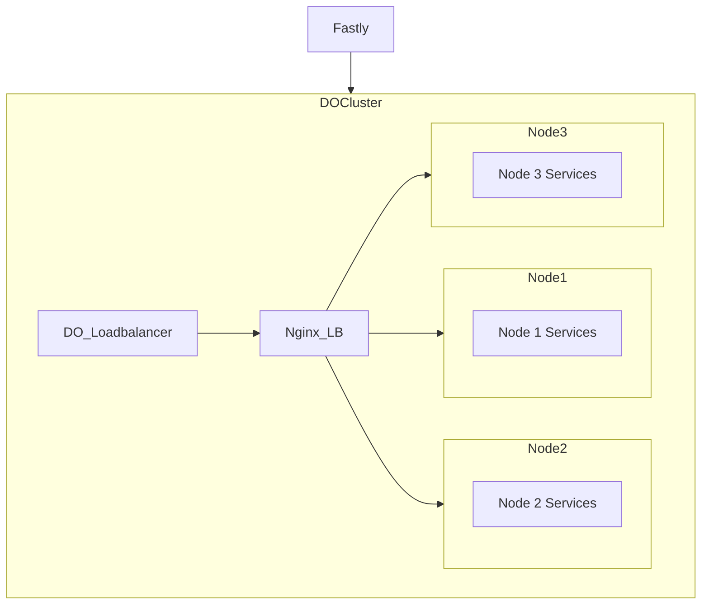

# Digital Ocean Setup

[Best practices](https://docs.digitalocean.com/developer-center/digitalocean-kubernetes-infrastructure-best-practices/)

## Network setup

We run 3 Nginx Ingress Load balancers, and will eventually setup so one per node, but they will load balance across all 3 nodes. 

## Database

- [Database Operator docs](https://docs.digitalocean.com/products/kubernetes/how-to/use-operator/)
- [Our deployment manifests](../platform/postgres/)

## Disk volumes

- [Volume Docs](https://docs.digitalocean.com/products/kubernetes/how-to/add-volumes/)
- [Sharing with NFS](
https://github.com/kubernetes-sigs/nfs-ganesha-server-and-external-provisioner)
- [Our deployment manifests](../platform/nfs-provisioner/)
