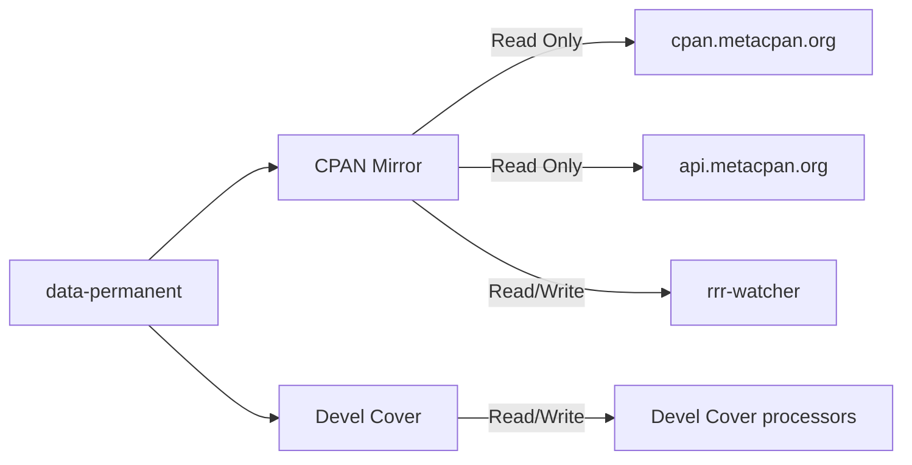
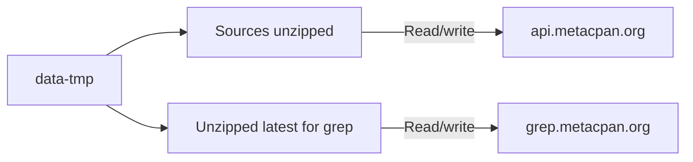

# root-storage

IGNORE FOR NOW - might be wrong!!!

Create two available types of storage for applications in the cluster

- data-volatile: anything that is ephemeral / can be re-created
- data-durable: data which can not be reproduced

### Durable examples

### Volatile examples

